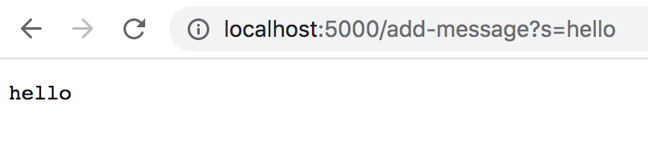
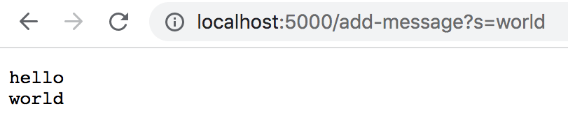
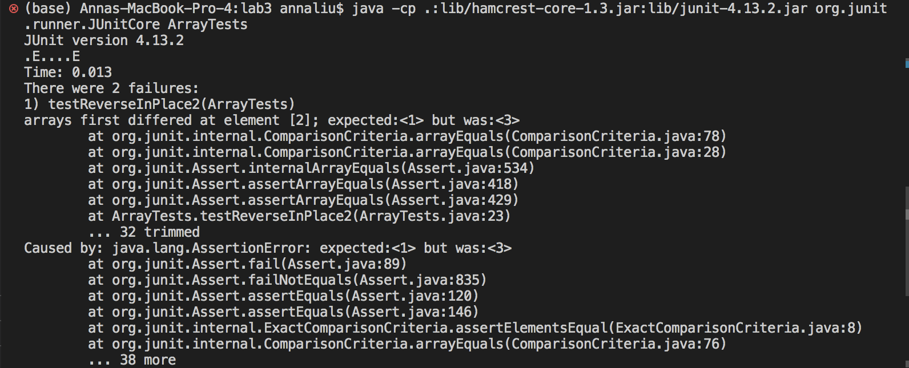
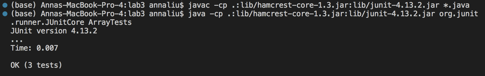

## Part 1
This is the code block for my StringServer program:
```
class Handler implements URLHandler {
    private String res = "";

    public String handleRequest(URI url) {
        String[] path_raw = url.getPath().split("/");
        String[] parameters = url.getQuery() != null ? url.getQuery().split("=") : new String[0];
        int count = 0;
        String[] path = new String[path_raw.length];
        
        for (int i = 0; i < path_raw.length; i++) {
            if (!path_raw[i].isEmpty()) {
                path[count] = path_raw[i];
                count++;
            }
        }

        if ((path[0].equals("add-message")) && (parameters[0].equals("s"))) {            
            res += parameters[1] + "\n";
            return res;
        }
        return "bad path";
    }
}

class StringServer {
    public static void main(String[] args) throws IOException {
        if (args.length == 0) {
            System.out.println("Missing port number! Try any number between 1024 to 49151");
            return;
        }

        int port = Integer.parseInt(args[0]);
        Server.start(port, new Handler());
    }
}
```

Here are the 2 screenshots of using `/add-message`:


For this screenshot, the handleRequest method is called, which takes in the argument specified as `url`. When called on this argument, this URI object represents the entire string `localhost:5000/add-message?s=hello`. The relevant field of the class is the string `res`, which gets updated to be the message directly after the `s` in the url once the specific request is executed.



Similar to the first screenshot, the handleRequest method is called, which takes in the argument specified as `url`. When called on this argument, this URI object represents the entire string `localhost:5000/add-message?s=world`. The relevant field of the class is the string `res`, which gets updated to be the message directly after the `s` in the url once the specific request is executed.


## Part 2
This is the code block for a failure-inducing bug as a Junit test for the reverseInPlace method in ArrayExamples.java.
```
@Test
public void testReverseInPlace2() {
  int[] input = {1, 2, 3};
  ArrayExamples.reverseInPlace(input);
  assertArrayEquals(new int[] {3, 2, 1}, input);
}
```

This is a code block for an input that doesn't induce a failure as a Junit test for the reverseInPlace method in ArrayExamples.java.
```
@Test 
public void testReverseInPlace() {
  int[] input1 = { 3 };
  ArrayExamples.reverseInPlace(input1);
  assertArrayEquals(new int[]{ 3 }, input1);
}
```

This is the symptom, or the output of running the 2 Junit tests above.
Buggy input:


Correct input:


These are the before and after code blocks of the bug for the reverseInPlace method.
Before (buggy):
```
static void reverseInPlace(int[] arr) {
  for(int i = 0; i < arr.length; i += 1) {
    arr[i] = arr[arr.length - i - 1];
  }
}
```

After (fixed):
```
static void reverseInPlace(int[] arr) {
  for(int i = 0; i < arr.length/2; i += 1) {
    int temp = arr[i];
    arr[i] = arr[arr.length - i - 1];
    arr[arr.length - i - 1] = temp;
  }
}
```

## Part 3
From both last week's and this week's lab, I learned how to fork a page from Github and how to use Github Desktop to clone a repository. Prior to this class, I didn't really have much experience with using Github Desktop or Github Pages, so I enjoyed getting hands on experience with this through this class.
