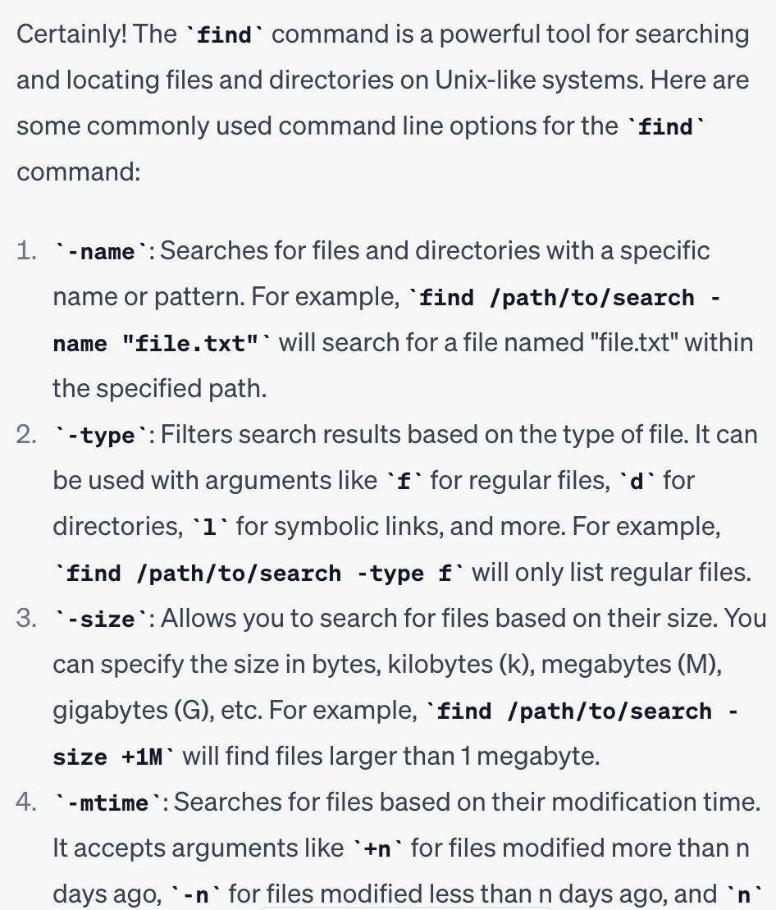
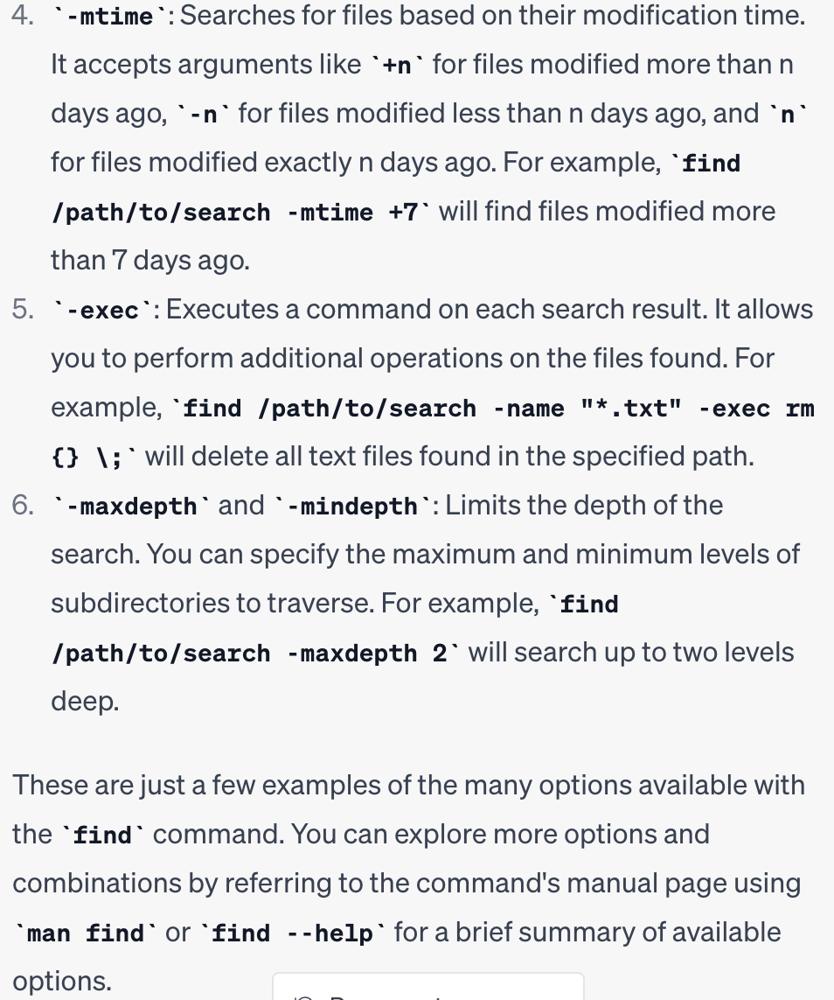

## Researching the `find` Command

### `-name` option:
Command: `find ./technical/911report -name chapter-1.txt`

Output:
```
./technical/911report/chapter-1.txt
```
This command helps us find and see whether the name of the txt file we're trying to find exists and can be accessed.


Command: `find ./technical/911report -name "*.txt"`

Output:
```
./technical/911report/chapter-13.4.txt
./technical/911report/chapter-13.5.txt
./technical/911report/chapter-13.1.txt
./technical/911report/chapter-13.2.txt
./technical/911report/chapter-13.3.txt
./technical/911report/chapter-3.txt
./technical/911report/chapter-2.txt
./technical/911report/chapter-1.txt
./technical/911report/chapter-5.txt
./technical/911report/chapter-6.txt
./technical/911report/chapter-7.txt
./technical/911report/chapter-9.txt
./technical/911report/chapter-8.txt
./technical/911report/preface.txt
./technical/911report/chapter-12.txt
./technical/911report/chapter-10.txt
./technical/911report/chapter-11.txt
```
This command helps us find all the files that end with .txt within the 911report folder. This could be helpful when we don't know the specific name of the file we're looking for.


### `-type` option:
Command: `find ./technical/911report -type f -name "*.txt"`

Output:
```
./technical/911report/chapter-13.4.txt
./technical/911report/chapter-13.5.txt
./technical/911report/chapter-13.1.txt
./technical/911report/chapter-13.2.txt
./technical/911report/chapter-13.3.txt
./technical/911report/chapter-3.txt
./technical/911report/chapter-2.txt
./technical/911report/chapter-1.txt
./technical/911report/chapter-5.txt
./technical/911report/chapter-6.txt
./technical/911report/chapter-7.txt
./technical/911report/chapter-9.txt
./technical/911report/chapter-8.txt
./technical/911report/preface.txt
./technical/911report/chapter-12.txt
./technical/911report/chapter-10.txt
./technical/911report/chapter-11.txt
```
This command finds all the files that end with .txt within the 911report subdirectory. This command is helpful when you don't know the specific name of a document.


Command: `find ./technical -type d`

Output:
```
./technical
./technical/government
./technical/government/About_LSC
./technical/government/Env_Prot_Agen
./technical/government/Alcohol_Problems
./technical/government/Gen_Account_Office
./technical/government/Post_Rate_Comm
./technical/government/Media
./technical/plos
./technical/biomed
./technical/911report
```
This command finds all the subdirectories within the ./technical directory and lists out all of them. This allows us to view all the subdirectories within a specific directory.


### `-maxdepth` option:
Command: `find ./technical/911report -maxdepth 2 -name "*.txt"`

Output:
```
./technical/911report/chapter-13.4.txt
./technical/911report/chapter-13.5.txt
./technical/911report/chapter-13.1.txt
./technical/911report/chapter-13.2.txt
./technical/911report/chapter-13.3.txt
./technical/911report/chapter-3.txt
./technical/911report/chapter-2.txt
./technical/911report/chapter-1.txt
./technical/911report/chapter-5.txt
./technical/911report/chapter-6.txt
./technical/911report/chapter-7.txt
./technical/911report/chapter-9.txt
./technical/911report/chapter-8.txt
./technical/911report/preface.txt
./technical/911report/chapter-12.txt
./technical/911report/chapter-10.txt
./technical/911report/chapter-11.txt
```
This command finds all the .txt files with a maximum depth of 2 directories deep. This command helps limit the number of subdirectories you search in when you look for a certain file or file type.

Command: `find ./technical/government/Alcohol_Problems -mindepth 1 -name "*.txt"`


Output:
```
./technical/government/Alcohol_Problems/Session2-PDF.txt
./technical/government/Alcohol_Problems/Session3-PDF.txt
./technical/government/Alcohol_Problems/DraftRecom-PDF.txt
./technical/government/Alcohol_Problems/Session4-PDF.txt
```
This command finds all the .txt files with a minimum depth of 2 directories deep. This command helps you ensure that you're finding all the files within a certain number of subdirectories.


### `-size` option:
Command: `find ./technical/911report -size -100k`

Output:
```
./technical/911report
./technical/911report/chapter-13.1.txt
./technical/911report/chapter-2.txt
./technical/911report/chapter-5.txt
./technical/911report/chapter-8.txt
./technical/911report/preface.txt
./technical/911report/chapter-10.txt
./technical/911report/chapter-11.txt
```
This command finds all the files within the 911report directory that have a size of less than 100 kilobytes. This command is useful because it can filter on file sizes.


Command: `find ./technical/911report -size +100k`

Output:
```
./technical/911report/chapter-13.4.txt
./technical/911report/chapter-13.5.txt
./technical/911report/chapter-13.2.txt
./technical/911report/chapter-13.3.txt
./technical/911report/chapter-3.txt
./technical/911report/chapter-1.txt
./technical/911report/chapter-6.txt
./technical/911report/chapter-7.txt
./technical/911report/chapter-9.txt
./technical/911report/chapter-12.txt
```
This command finds all the files within the 911report directory that have a size of greater than 100 kilobytes. This command is useful because it can filter on file sizes.


*Source: All commands were found through ChatGPT*
*Input I gave ChatGPT: "give me examples of find command line options"*
*Output of ChatGPT:*



I used ChatGPT's output as a baseline reference and ideas for find command line options. I looked up official documentation when trying out the command myself.
