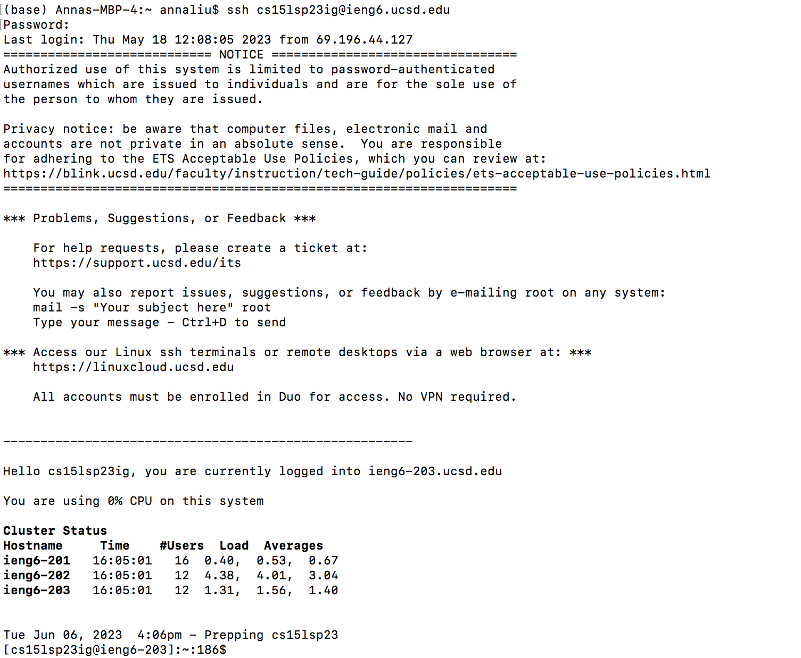
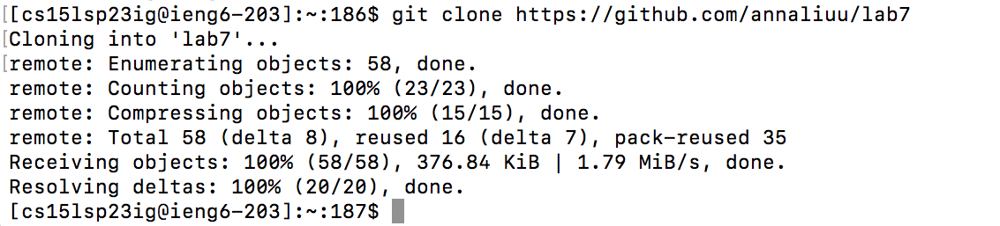
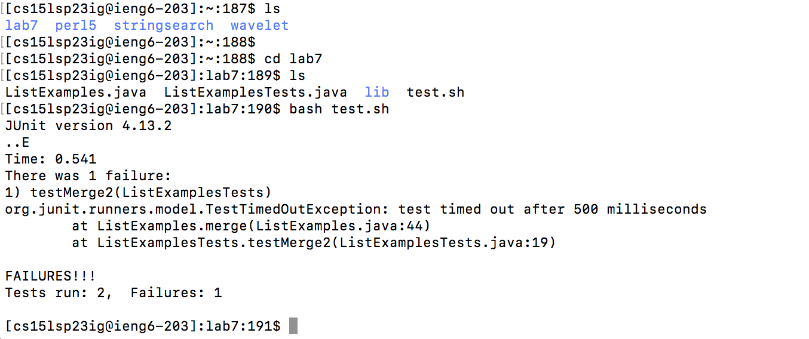
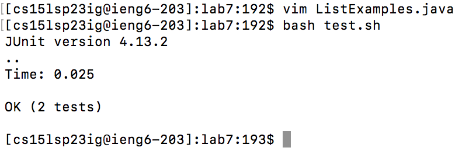
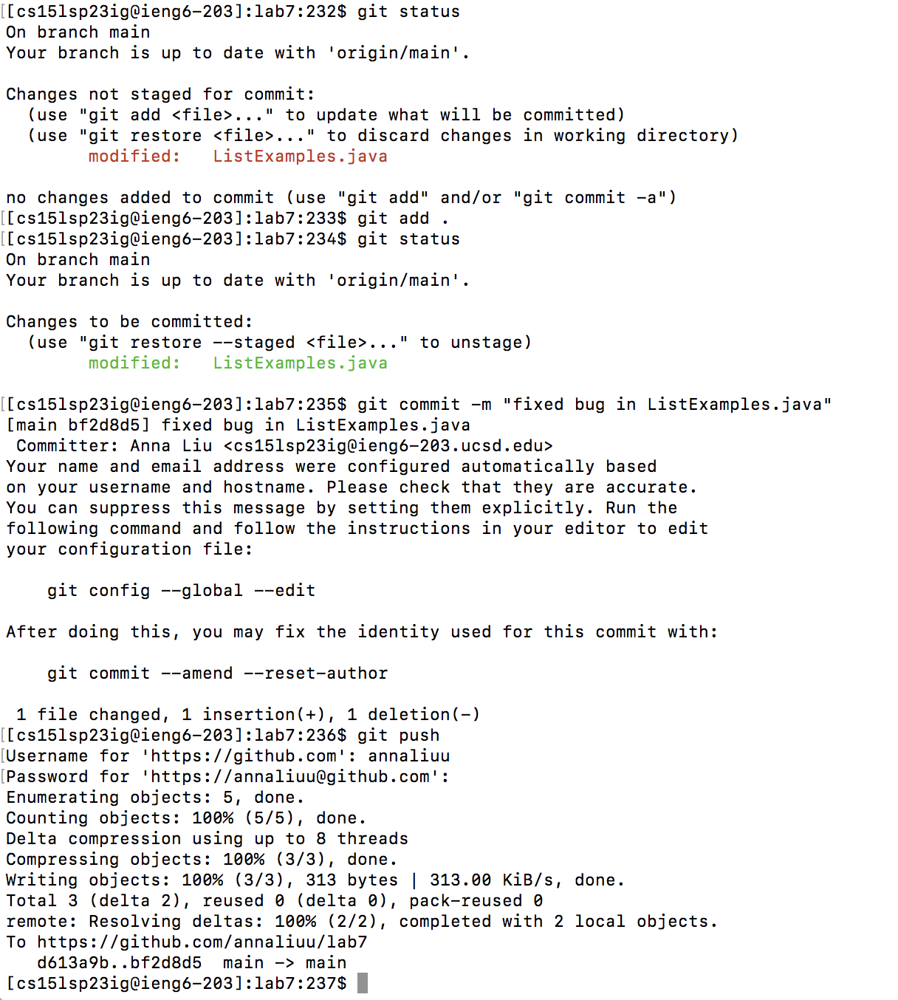

# Lab Report 4

## Log into ieng6

Keys pressed: First, type `ssh cs15lsp23ig@ieng6.ucsd.edu` into the terminal, with the `ig`
able to be changed based on your specific account. Then, press `<Enter>`. This command logs you on to
the ieng6 environment.

## Clone fork of the repository

Keys pressed: First, type `git clone https://github.com/annaliuu/lab7` into the terminal.
Then, press `<Enter>`. This command allows you to clone the lab 7 repository you had initially forked.

## Run the failed tests

Keys pressed: First, type `ls` and `<Enter>` to view all the files in the current directory.
Then, to go into the lab7 directory, type in `cd lab7` and `<Enter>`. After that, you can type `ls`
again if you want to see all the files within lab7, but this step is not necessary.
Then, you can finally run `bash test.sh` in order to run the script. Finally, press
`<Enter>`.

## Edit code

Keys pressed: First, type in `vim ListExamples.java`. Then, press `<Enter>` and once
you enter the vim environment, press `<down><down><right><right>` to get to the
correct position. Then, enter and change the character 1 to 2 using the command
`<i><delete><2>`, with the `i` switching us into editing mode and allowing us to
replace the 1 with the 2. Finally, press `<esc>:wq` to save and exit out of the vim environment.

## Run the successful tests

Keys pressed: First, type in `bash test.sh` to run the script and see if the tests pass. Then, press `<Enter>`.

## Commit and push changes to Github account

Keys pressed: First, you can optionally check the status of your files by typing in
`git status` and `<Enter>`. Then, you add the changed files to the staging area by running
`git add .` and `<Enter>`. After that, you run `git commit -m "commit message"` (with "commit message"
being a custom message of your choice), as well as `<Enter>`. Finally, you can run `git push` and `<Enter>`, and
then type in your Github username and password to push all your changes to your Github account.

