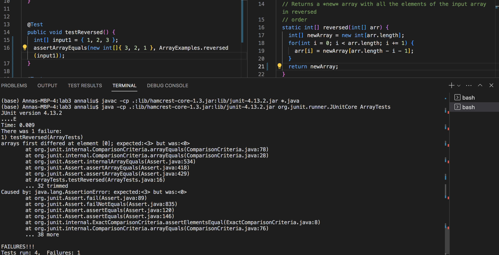
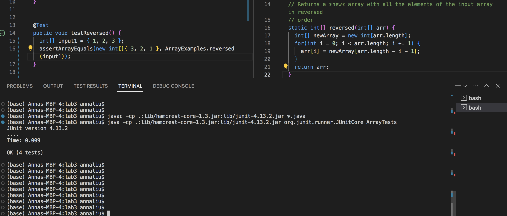

## Part 1
### Symptom and description of guess:

I'm currently using a macbook laptop and running the above code through VSCode. I'm running into an ArrayIndexOutOfBounds exception, but I'm not sure where I'm going wrong. I've double checked and I believe that the logic of my implementation is correct. My answer seems to always return the input array though, so I believe that the error roughly falls along this line. However, I would appreciate some help with figuring out where exactly my error lies. The failure-inducing input occurs when I call the testReversed method with the example input array ({1, 2, 3}) in the ArrayTests.java file, as pictured above.

### Response from TA:
Looking at the screenshot that you have provided, it seems that the logic of your code is primarily correct. However, I would double check the variable that you are returning, as the variable you are returning has not been modified since the start of the function.

### Follow-up from student in response:
After fixing the failure-induicng input:

Thank you for your response! I just double checked the entire function again and I believe that I have caught my mistake. I had initially returned the array that I had copied over from the input, rather than the array that I modified in place. Thus, my initial function simply returned the input array, rather than the successfully reversed array. Thank you for all your help.

## Part 2
While there are several useful and cool things I learned throughout the second half of this course, something that I found particularly interesting was during lab 7 when we learned about vim. Playing around on vimtutor was quite fun and I was able to learn a lot about
the different and most common vim commands. Because I had previously never used vim before, this online tutorial allowed me to gain my first exposure to vim and I was able to run several commands that I could see being useful and applicable in the real world. The hands
on practice was something that I really appreciated and it helped me better understand the purpose and output of each command.
